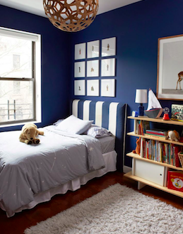
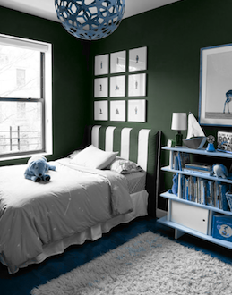
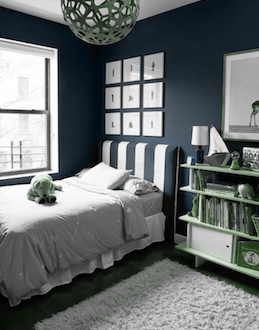

#Image recoloring using linear template mapping 基于线性映射模板的色彩转移

>based on 《Image recoloring using linear template mapping》
>

### Install

### Usage
    _root_dir = os.path.dirname(__file__)
    reuslt = linear_recolor(_root_dir + '/image/apple/manifest.png',
                  _root_dir + '/image/apple/source.png',
                   reverse_map=True)

    cv2.imwrite('./test2.png', reuslt)
    
    reverse_map:参数指明 线性映射的方向，可选值：False || True 

### Advance Usage
manifest.png could be created by this program [Grayscale](https://github.com/freedomofme/Grayscale).

    som = SOMGraySclae()
    manifest = som.get_1d_manifold(one_souce_image)

#### 原图(source.png)：

#### 模板(manifest.png)（基于Data-driven Color Manifolds 生成）

#### 效果图

==
